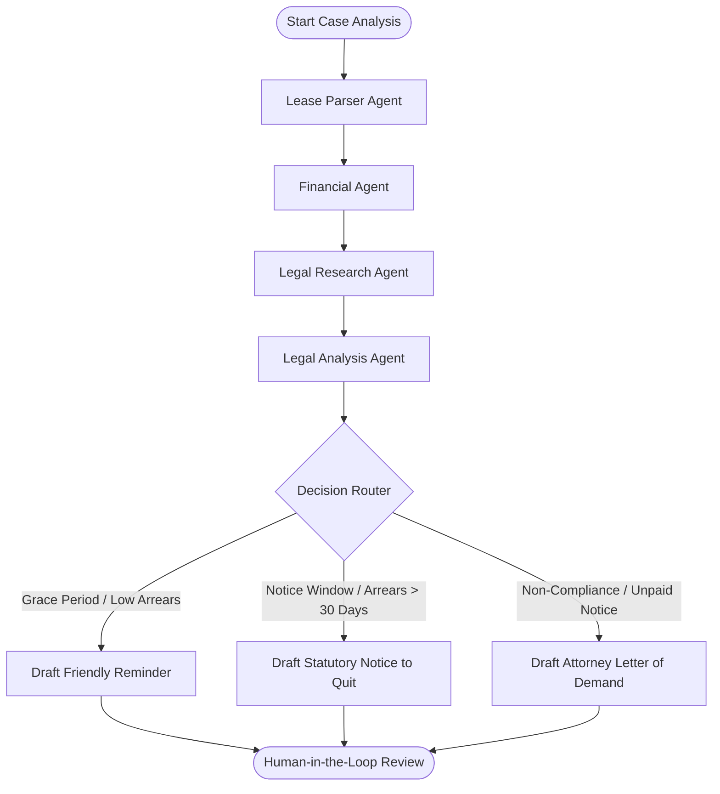

# LegalFlow AI — AI-Powered Commercial Tenancy Legal Compliance Platform

LegalFlow AI is an AI-powered legal compliance and automation platform designed to assist commercial landlords and property managers in managing tenancy agreements and legal workflows. 

By combining workflow automation, Retrieval-Augmented Generation (RAG), and a Multi-Agent AI architecture, the platform simplifies and automates the process of handling rent payment defaults. Instead of operating as a traditional legal chatbot, LegalFlow AI orchestrates multiple specialized AI agents to collaboratively analyze lease terms, evaluate payment histories, retrieve relevant legal knowledge under Sri Lankan statutes, assess compliance, and generate formal legal notices while keeping landlords in control through a Human-in-the-Loop approval workflow.

---

## 🏛️ System Core Features

1. **AI-Assisted Lease Parsing & Onboarding**: Automatically reads and extracts key schedules, covenants, utility account bindings, and financial terms (monthly rent, service charges, grace periods) directly from uploaded lease agreements.
2. **Deterministic Financial Engine**: Computes exact payment arrears, overdue days, and statutory interest rate percentages (12.0% p.a.). To eliminate hallucinations, all financial calculations are computed deterministically; the AI agents ingest these facts as immutable state.
3. **LlamaIndex + LangChain Legal RAG**: Structural semantic chunking of Sri Lankan statutes (such as the *Recovery of Possession of Premises Given on Lease Act No. 1 of 2023*, *Rent Act No. 7 of 1972*, and *Civil Procedure Code*) indexed in ChromaDB.
4. **LangGraph Multi-Agent Orchestration**: Specialized agents collaborate to assess compliance, search case law, and draft formal legal notices.
5. **Human-in-the-Loop Approval**: Generated document drafts are presented to the landlord for review, modification, or rejection before final execution.
6. **n8n Utility Billing Integration**: Automated email parser that monitors CEB/NWSDB statements, extracts billing amounts, associates them with active lease records, and notifies tenants automatically.

---

## 🤖 Multi-Agent AI Workflow (LangGraph)

The platform utilizes a structured LangGraph state machine to coordinate specialized agents. Each agent possesses a single responsibility to maximize accuracy and maintainability:



### Specialized Agents:
*   **Lease Parser Agent**: Extracts structured metadata from unstructured lease agreement documents.
*   **Financial Agent**: Evaluates the tenant's current payment timeline against the deterministic output of the financial engine.
*   **Legal Research Agent**: Performs semantic RAG queries against ChromaDB to find relevant statutory sections (e.g., Act No. 1 of 2023) to back the claim.
*   **Legal Analysis Agent**: Synthesizes the facts, outstanding payment logs, and laws to recommend the correct course of action.
*   **Drafting Agent**: Loads specific legal templates and drafts notices using the extracted data and case facts.

---

## 🛠️ Technology Stack

*   **Backend API**: Python 3.11, FastAPI, SQLAlchemy 2.0 (Async), Pydantic v2, PostgreSQL (Supabase)
*   **Frontend UI**: React, Vite, TypeScript, Tailwind CSS, Lucide icons, Sonner toast
*   **AI & Vector Storage**: LangGraph, LangChain, LlamaIndex, ChromaDB, HuggingFace Embeddings
*   **LLM Model**: Mistral Large & Gemini 2.5/3.5 (via OpenRouter / Google AI Studio)
*   **Integration**: n8n workflow engine

---

## 🚀 Setup & Installation Guide

### Option A: Docker Setup (Recommended)

1.  **Clone the repository** and copy the environment template:
    ```bash
    cp .env.example .env
    ```
2.  **Configure `.env`**: Add your `OPENROUTER_API_KEY` or `GEMINI_API_KEY` for LLM generation.
3.  **Spin up all services**:
    ```bash
    docker-compose up --build -d
    ```

#### Active Ports & Access Points:
*   **FastAPI Core API**: `http://localhost:8005/docs`
*   **AI Microservice (LangGraph)**: `http://localhost:8001/docs`
*   **RAG Microservice**: `http://localhost:8002/docs`
*   **n8n Console**: `http://localhost:5678` (Login: `admin` / `admin`)
*   **ChromaDB Vector Store**: `http://localhost:8000`

---

### Option B: Local Setup (Manual Development)

To run the platform locally outside of Docker containers, follow these steps:

#### 1. Setup Backend Services
Ensure you have Python 3.11+ installed. Run the following in the `LegalFlow_AI_backend` directory:
```bash
# Create and activate a virtual environment
python3 -m venv venv
source venv/bin/activate

# Install dependencies
pip install -r backend/requirements.txt
pip install -r rag/requirements.txt
pip install -r ai_service/requirements.txt
```

Initialize the database migrations:
```bash
alembic upgrade head
```

#### 2. Run the Services
Start the services in separate terminal sessions:

*   **RAG Service & Indexing**:
    ```bash
    # Index the Sri Lankan Rent Act PDFs in ChromaDB
    python3 -m rag.main
    ```
*   **AI Agent Service (LangGraph)**:
    ```bash
    python3 -m ai_service.main
    ```
*   **Core Backend REST API**:
    ```bash
    python3 -m backend.main
    ```

#### 3. Setup Frontend Application
Navigate to the `LegalFlow_Al_frontend` directory:
```bash
# Install Node dependencies
npm install

# Create environment configuration
echo "VITE_API_URL=http://localhost:8000" > .env

# Start the local development server
npm run dev
```
Open your browser to `http://localhost:5173` to access the portal dashboard.
